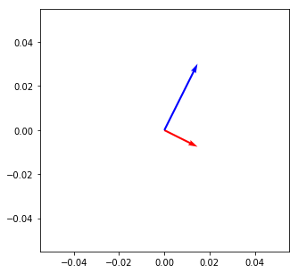

### Questions
* Clarification on dot product vs dot method

### Objectives
YWBAT 
* calculate and interpret the dot product of 2 vectors
* predict the outcome of matrix multiplication
* give the resulting dimensions of the product of matrices
* test if a matrix is orthonormal

### Outline
* Take Questions
* Present Outline
* Linear Algebra Overview
    * How we use it every time we see a dataframe
    * Why we use Linear Algebra
* Discuss dot product
* Discuss Matrix Multiplication
* Compare MM with Numpy multiplication
* Assess knowledge


```python
import pandas as pd
import numpy as np

import matplotlib.pyplot as plt
```

**Orthogonality**


```python
x1 = np.array([4, -2])
x2 = np.array([4, 8])

V=np.array([x1,x2])
origin =[0],[0]
```


```python
plt.figure(figsize=(5, 5))
plt.quiver(*origin, V[:,0],V[:,1], scale=30, color=['r','b'])
plt.show()
```





### Assessment


```python
# Calculate the dot product and interpret the results
x1 = np.array([1, 1, 1])
x2 = np.array([1, 1, 1])
```


```python
# Calculate the dot product and interpret the results
x1 = np.array([1, -1, 0])
x2 = np.array([1, 1, 1])
```


```python
# Create 2 vectors that are orthogonal and non-trivial
```
